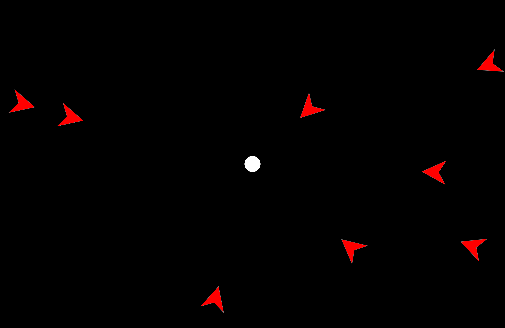

# Wolfpack Effect Demo



This repository contains two interactive demonstrations of the Wolfpack Effect (Gao et al.,2010). The demos are built
with [PsychoPy](https://www.psychopy.org/), a Python library for creating psychology experiments.

## What is the Wolfpack Effect?

The Wolfpack Effect is a perceptual phenomenon in which moving objects that consistently face toward a target object
appear to be engaged in goal-directed pursuit, even if their motion trajectories are entirely random. This effect
demonstrates how subtle visual cues of facingness can trigger perceptions of animacy and intent in otherwise simple
moving shapes.

## Demo types

This repository includes two interactive demonstrations:

### 1. Standard demo (`demo.py`)

A simple visualization where:

- You control a white circle ("sheep") by moving your mouse
- Several darts ("wolves") move around the screen with random (smoothly changing) trajectories
- Press `spacebar` to toggle between the two conditions:
  - **Wolfpack condition**: The darts always face toward your cursor
  - **Perpendicular Control condition**: The darts face 90 degrees away from your cursor
  - This toggle will help you appreciate how changing the darts' orientations can completely change your perception of
    their intentionality

### 2. "Don't Get Caught" game (`dont_get_caught.py`)

A gamified version of Gao et al.'s (2010) Experiment 2 in which:

- You control a green circle by moving your mouse
- One white circle acts as a "hunter" that pursues you
- Multiple distractors move randomly:
  - White circles that behave similarly to the hunter, randomly moving around the screen and smoothly changing their
    trajectories
  - Blue darts that either face you or face 90 degrees away from you depending on the condition
- Your goal is to survive for 10 seconds without being caught by the hunter
- Press `spacebar` to toggle whether the blue darts face you (Wolfpack condition) or face away (Perpendicular Control
  condition)

## Installation

```bash
# Install the required dependencies
pip install -r requirements.txt

# Run the standard demonstration
python demo.py

# Run the "don't get caught" game
python dont_get_caught.py
```

## Testing

You can run the tests by running `pytest` in the root directory.

`python -m pytest`

When running the game, the circle should follow your mouse cursor, and stay within the bounded area.
You should also be able to press `spacebar` to toggle between the wolves facing your cursor and facing 90 degrees away. This should happen instantaneously. The wolves should have their facing direction change depending on where your cursor is accordingly.

When running the "Don't get caught" game, there should also be an automatically updating timer and scoreboard. After 10 seconds of survival, the game should end with a victory screen. Getting caught before then should end the game with a game over screen.

## Code structure

- `demo.py` - Simple demonstration of the wolfpack effect
- `dont_get_caught.py` - Interactive game testing avoidance behavior
- `src/` - Core implementation
  - `agents.py` - Defines the `Agent` base class and `Wolf`/`Sheep` subclasses
  - `config.py` - Configuration settings for the various demos and agent parameters
  - `utils.py` - Utility functions for dealing with PsychoPy
  - `__init__.py` - Empty file that marks `src` as a Python package

## Controls

- **Mouse movement**: Control the position of your "Sheep" cursor
- **Spacebar**: Toggle between experimental conditions (wolfpack vs. perpendicular control)
- **Escape**: Quit the demonstration

## References

Gao, T., McCarthy, G., & Scholl, B. J. (2010). The wolfpack effect: Perception of animacy irresistibly influences
interactive behavior. _Psychological Science_, _21_(12), 1845-1853.
